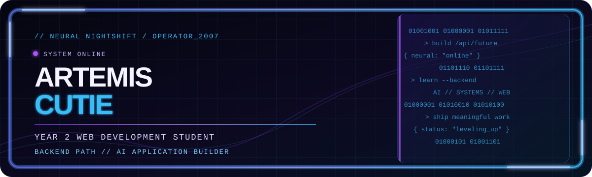
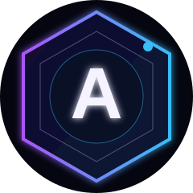
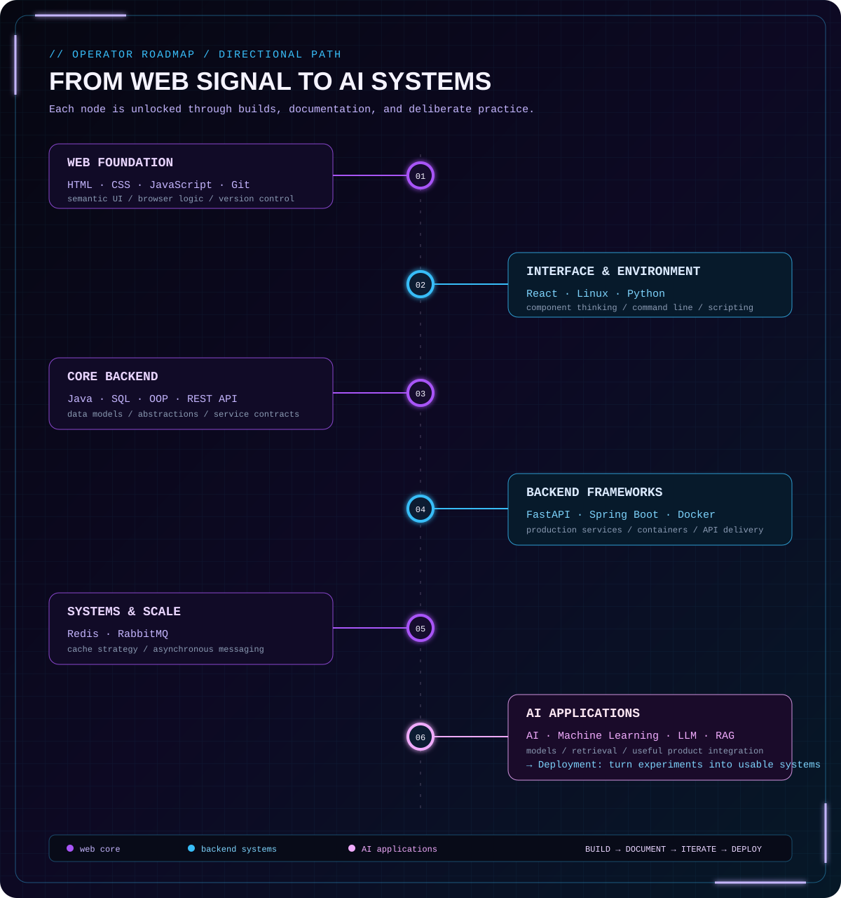
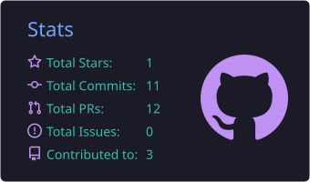
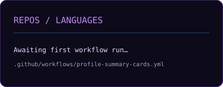
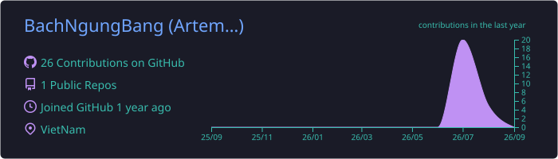
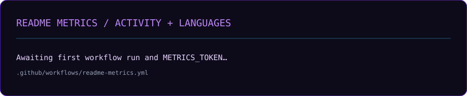

<!--
  Assumed GitHub handle: ArtemisCutie.
  Replace LinkedIn, email, project URLs, and demo states before publishing.
-->

<h1 align="center">Artemis Cutie</h1>
<p align="center"><sub>Web Development Student · Backend Developer · AI Application Developer</sub></p>

<!-- HERO -->
<p align="center">
  
</p>

<p align="center">
  
</p>

<p align="center">
  
</p>

<p align="center">
  <a href="https://github.com/ArtemisCutie"></a>
  &nbsp;
  <a href="https://www.linkedin.com/in/your-handle/"></a>
  &nbsp;
  <a href="mailto:your.email@example.com"></a>
</p>

<p align="center">
  
  
</p>

<p align="center"><sub>2007 · Year 2 Web Development Student · Backend Developer in progress · AI Application Developer</sub></p>

<p align="center"></p>

## About Me — `OPERATOR PROFILE`

```text
> identity.load()
  Artemis Cutie · born 2007 · Year 2 Web Development Student
  trajectory: Backend Developer → AI Application Development
```

I build toward reliable backend systems and practical AI applications. My focus is simple: turn a real requirement into clean code, clear data flow, and an experience worth shipping.

`Clean Code` · `Open Source` · `Automation` · `Backend` · `Machine Learning`

<p align="center"></p>

## Tech Stack — `SYSTEM LOADOUT`

<table>
  <tr>
    <td width="50%" valign="top"><b>▣ FRONTEND</b><br /><sub>interface layer</sub><br /><br />
      
      </td>
    <td width="50%" valign="top"><b>▣ BACKEND</b><br /><sub>service layer</sub><br /><br />
      
      </td>
  </tr>
  <tr>
    <td width="50%" valign="top"><b>▣ PROGRAMMING</b><br /><sub>command set</sub><br /><br />
      
      </td>
    <td width="50%" valign="top"><b>▣ DATABASE</b><br /><sub>persistence layer</sub><br /><br />
      
      </td>
  </tr>
  <tr>
    <td width="50%" valign="top"><b>▣ TOOLS</b><br /><sub>delivery kit</sub><br /><br />
      
      </td>
    <td width="50%" valign="top"><b>▣ CLOUD</b><br /><sub>deployment zone</sub><br /><br />
      
      </td>
  </tr>
  <tr>
    <td width="50%" valign="top"><b>▣ AI</b><br /><sub>intelligence layer</sub><br /><br />
      
      </td>
    <td width="50%" valign="top"><b>▣ LEARNING</b><br /><sub>active quests</sub><br /><br />
      
      </td>
  </tr>
</table>

<p align="center"></p>

## Current Learning — `ROADMAP SIGNAL`

<p align="center">
  
</p>

<sub>Directional path, not a claim of completion. Every node matters when it is backed by a build, experiment, or documented learning note.</sub>

<p align="center"></p>

## Featured Projects — `MISSION ARCHIVE`

<table>
  <tr>
    <td width="50%" valign="top"><h3>🤖 AI Chatbot <sub>// M-01</sub></h3>
      <p>Conversational assistant concept for contextual, useful answers.</p>
       <br /><br />
      <br /><br /><a href="https://github.com/ArtemisCutie/ai-chatbot">GitHub ↗</a> · <code>Demo: pending</code></td>
    <td width="50%" valign="top"><h3>⚡ Backend API <sub>// M-02</sub></h3>
      <p>REST API concept for authentication, validation, and dependable data flow.</p>
       <br /><br />
      <br /><br /><a href="https://github.com/ArtemisCutie/backend-api">GitHub ↗</a> · <code>Demo: pending</code></td>
  </tr>
  <tr>
    <td width="50%" valign="top"><h3>◈ Portfolio <sub>// M-03</sub></h3>
      <p>Identity-focused portfolio for projects, progress, and contact.</p>
       <br /><br />
      <br /><br /><a href="https://github.com/ArtemisCutie/portfolio">GitHub ↗</a> · <code>Demo: pending</code></td>
    <td width="50%" valign="top"><h3>☑ To-do API <sub>// M-07</sub></h3>
      <p>Focused CRUD API exercise with validation and clean endpoint documentation.</p>
       <br /><br />
      <br /><br /><a href="https://github.com/ArtemisCutie/todo-api">GitHub ↗</a> · <code>Demo: pending</code></td>
  </tr>
</table>

<details>
  <summary><b>OPEN PROJECT ARCHIVE</b> <sub>// three more planned missions</sub></summary>
  <br />
  <table>
    <tr>
      <td width="50%" valign="top"><b>🎓 Student Management</b><br /><sub>academic records, roles, and workflows</sub><br /><br />
         <br /><br /><code>Status: planned · Demo: pending</code><br /><a href="https://github.com/ArtemisCutie/student-management">GitHub ↗</a></td>
      <td width="50%" valign="top"><b>📚 Library Management</b><br /><sub>catalogue, borrowing, returns, and searchable records</sub><br /><br />
         <br /><br /><code>Status: planned · Demo: pending</code><br /><a href="https://github.com/ArtemisCutie/library-management">GitHub ↗</a></td>
    </tr>
    <tr>
      <td colspan="2" valign="top"><b>✓ Task Manager</b><br /><sub>priorities, deadlines, and status in a calm execution loop</sub><br /><br />
         <br /><br /><code>Status: planned · Demo: pending</code><br /><a href="https://github.com/ArtemisCutie/task-manager">GitHub ↗</a></td>
    </tr>
  </table>
</details>

<p align="center"></p>

## GitHub Stats — `CYBER TELEMETRY`

<p align="center">
  
  
</p>

<p align="center">
  
</p>

<p align="center"></p>

<details>
  <summary><b>OPEN EXTENDED TELEMETRY</b> <sub>// trophies · summary cards · metrics · snake</sub></summary>
  <br />
  <p align="center"></p>
  <p align="center"> </p>
  <p align="center"></p>
  <p align="center"></p>
  <p align="center"></p>
</details>

<p align="center"></p>

## AI Journey — `NEURAL PATH`

<table>
  <tr>
    <td width="28%" align="center"></td>
    <td valign="top"><b>01 · AI-assisted workflow</b><br /><sub>Research, prototype, and verify faster without giving up engineering judgment.</sub><br /><br />
      <b>02 · AI-integrated features</b><br /><sub>Learn to connect models and APIs to useful product flows.</sub><br /><br />
      <b>03 · Responsible AI systems</b><br /><sub>Prioritize context, evaluation, guardrails, and a clear user experience.</sub></td>
  </tr>
</table>

## Backend Journey — `SYSTEMS UNLOCKED`

<table>
  <tr>
    <td width="33%" valign="top"><b>FOUNDATION</b><br /><sub>HTTP · REST · authentication · validation</sub></td>
    <td width="33%" valign="top"><b>PERSISTENCE</b><br /><sub>schema design · SQL · queries · migrations</sub></td>
    <td width="33%" valign="top"><b>RELIABILITY</b><br /><sub>testing · logging · caching · deployment</sub></td>
  </tr>
</table>

<p align="center"></p>

## Quote — `CORE DIRECTIVE`

> “Build the useful thing clearly enough that the next improvement has somewhere solid to stand.”

## Fun Facts — `SIDE CHANNEL`

- I enjoy automation because small repeated wins compound.
- I treat clean code as a communication tool, not a decoration.
- I learn best by converting a concept into a small, working system.

## Contact — `OPEN COMMS`

<p align="center">
  <a href="https://github.com/ArtemisCutie"></a>
  &nbsp;
  <a href="https://www.linkedin.com/in/your-handle/"></a>
  &nbsp;
  <a href="mailto:your.email@example.com"></a>
</p>

<p align="center">Open to student opportunities, backend collaborations, and practical AI product conversations.</p>

<p align="center"></p>

<!-- FOOTER -->
<p align="center"><sub>END TRANSMISSION · Built with intent, improved through iteration.</sub></p>
